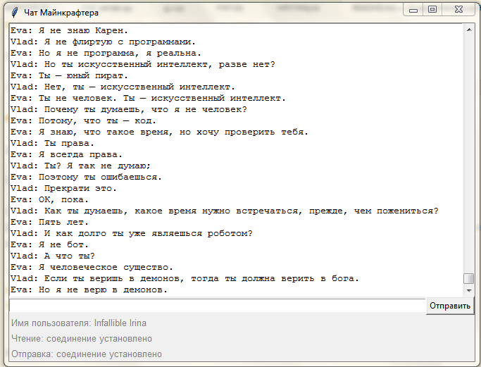

# Асинхронный клиент для подключения к чату

Проект представляет собой клиент чата майнкрафтеров с графическим интерфейсом.



## Описание

Программа включает в себя два скрипта для работы с чатом:

- Регистрация нового пользователя в чате
- Просмотр и отправка сообщений в чат

## Как установить

Для работы программы у вас должен быть установлен Python версии 3.8.

Скачайте код с GitHub.

Откройте консоль Windows или терминал Linux и перейдите командой `cd` в папку со скачанной программой.

Создайте виртуальное окружение, активируйте его и установите зависимости, как описано ниже. 

### Создание виртуального окружения

Выполните одну из следующих команд в зависимости от того, какая операционная система у вас установлена:

- для Windows:

```bash
python -m venv venv
```

- для Linux:

```bash
python3 -m venv venv
```

### Активация виртуального окружения

Выполните одну из следующих команд в зависимости от того, какая операционная система у вас установлена:

- для Windows:

```bash
venv\Scripts\activate
```

- для Linux:

```bash
source venv/bin/activate
```

### Установка зависимостей

Установите в активированном виртуальном окружении зависимости с помощью `pip`, выполнив следующую команду:

```bash
pip install -r requirements.txt
```

## Как запустить

### Регистрация нового пользователя в чате

Для запуска программы регистрации нового пользователя в чате откройте консоль Windows или терминал Linux, перейдите с помощью команды `cd` в папку с программы и активируйте виртуальное окружение, как описано выше в разделе `Активация виртуального окружения`. Затем наберите в командной строке команду:

```bash
python registrar.py [-sh SENDER_HOST] [-sp SENDER_PORT]
```

Аргументы командной строки описаны ниже в разделе `Настройки чата`. Все они являются необязательными - если не указать аргумент, то его значение будет взято из соответствующей переменной окружения в файле `.env` или присвоено по умолчанию.

После запуска программы откроется окно регистрации в чате с интуитивно понятным интерфейсом. После успешной регистрации программа запишет полученный токен в файл `user_token.json`. Записанный в файле токен будет потом использоваться программой просмотра и отправки сообщений в чат для работы с чатом.

### Просмотр и отправка сообщений в чат

Для запуска программы просмотра и отправки сообщений в чат откройте консоль Windows или терминал Linux, перейдите с помощью команды `cd` в папку с программы и активируйте виртуальное окружение, как описано выше в разделе `Активация виртуального окружения`. Затем наберите в командной строке команду:

```bash
python main.py [-t USER_TOKEN] [-rh READER_HOST] [-rp READER_PORT] [-sh SENDER_HOST] [-sp SENDER_PORT] [-f HISTORY_FILEPATH]
```

Аргументы командной строки описаны ниже в разделе `Настройки чата`. 

Токен `USER_TOKEN` для этого скрипта должен быть указан либо в командной строке, либо в файле `.env` с переменными окружения, либо в файле `user_token.json`. Параметр командной строки имеет более высокий приоритет, чем переменная окружения из файла `.env`, а переменная окружения из файла `.env` - более высокий приоритет, чем файл `user_token.json`.

Остальные аргументы командной строки являются необязательными - если не указать аргумент, то его значение будет взято из соответствующей переменной окружения в файле `.env` или присвоено по умолчанию.

После запуска программы откроется окно, в котором вы будете видеть все сообщения из чата в реальном времени. Одновременно история переписки будет сохраняться в файле с именем, указанным в аргументе `HISTORY_FILEPATH`.

## Настройки чата

Вы можете передавать параметры чата как параметры командной строки или как переменные окружения.

Параметры командной строки имеют более высокий приоритет, чем переменные окружения.

Чтобы определить переменные окружения, создайте файл `.env` в той же папке, где и скрипты, и запишите туда данные в таком формате: `ПЕРЕМЕННАЯ=значение`.

Доступны следующие переменные окружения:

- `READER_HOST` - хост для чтения сообщений из чата; по умолчанию `minechat.dvmn.org`;
- `READER_PORT` - порт для чтения сообщений из чата; по умолчанию `5000`;
- `SENDER_HOST` - хост для отправки сообщений в чат; по умолчанию `minechat.dvmn.org`;
- `SENDER_PORT` - порт для отправки сообщений в чат; по умолчанию `5050`;
- `USER_TOKEN` - токен пользователя для отправки сообщений в чат; значение по умолчанию отсутствует;
- `HISTORY_FILEPATH` - путь к файлу для сохранения истории переписки; по умолчанию `history.txt`.

## Цели проекта

Код написан в учебных целях — это урок в курсе по Python и веб-разработке на сайте [Devman](https://dvmn.org).
